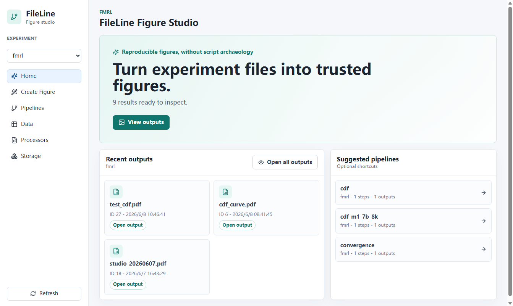
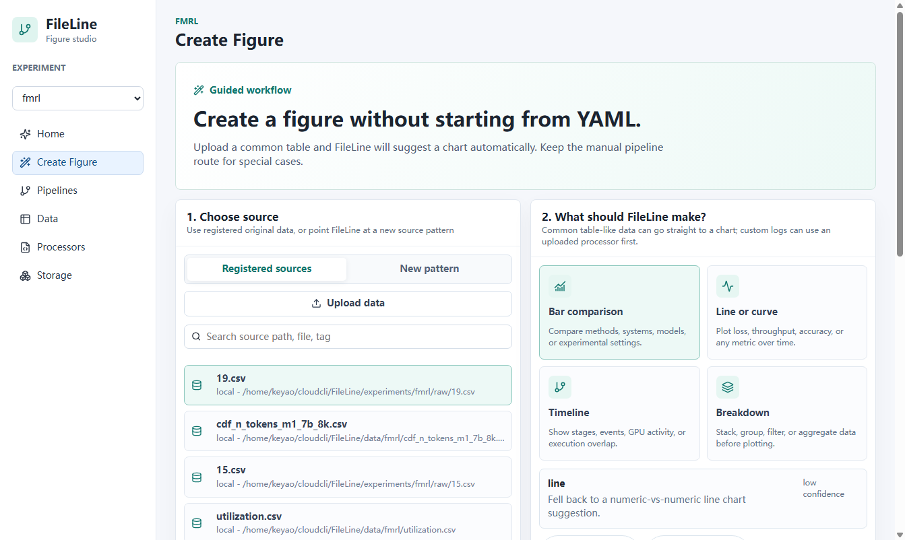
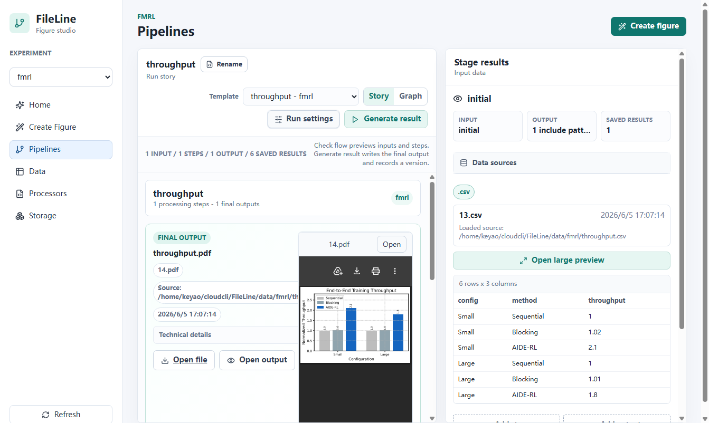
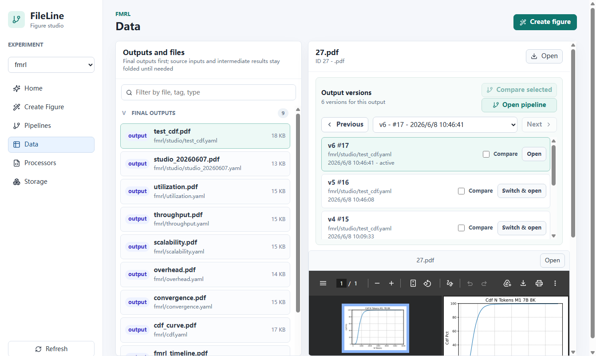
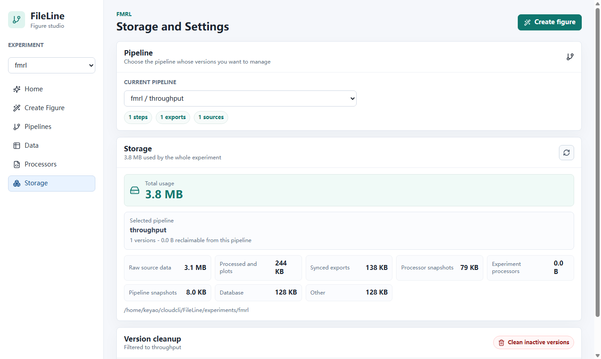

# FileLine

> 中文主文档。English documentation: [README.en.md](README.en.md)

FileLine 是一个面向科研实验的数据流与结果生产工具。它把原始文件、处理中间结果、最终产物、pipeline、processor、缓存和版本记录放在同一条可追溯链路里，帮助你回答一个科研项目里最常见但最麻烦的问题：

- 这个最终产物是哪条 pipeline 生成的？
- 它用了哪些原始数据和中间结果？
- 当时的 processor 代码和参数是什么？
- 能不能预览或恢复旧版本？
- 没改任何东西时，能不能直接走缓存而不是重复生成？

FileLine 同时支持 **Web Studio** 和 **CLI**。两者共享同一套实验目录、SQLite 数据库、processor registry、pipeline runner、缓存和版本记录，因此你可以在 Web 里浏览和调参，也可以在命令行里批量自动化。

## 适合谁

FileLine 特别适合这些场景：

- 实验输出很多，原始数据、CSV、parquet、log、PDF、图片经常混在一起。
- 画图脚本或数据清洗脚本经常复制修改，过一段时间就忘记哪个结果来自哪个版本。
- 希望保留中间结果和 lineage，方便论文复现、审稿补图或排查异常。
- 希望同一套流程既能给熟练用户命令行自动化，也能给新用户 Web 界面上手。
- 希望缓存重复处理步骤，避免相同输入、参数、processor 代码反复计算。

## 核心能力

- **实验隔离**：每个 experiment 都有独立数据目录、数据库、导出结果、processor 和 pipeline 快照。
- **Web Studio**：提供 Home、Create Figure、Pipelines、Data、Processors、Storage 页面。
- **结果优先的数据浏览**：Data 页默认展示 Final outputs，Source inputs 和 Intermediate results 折叠在下方。
- **Lineage 追溯**：可以从最终产物跳到源数据/中间结果，也可以从源数据回到最终产物。
- **Pipeline DAG**：YAML pipeline 支持串联、分支、多输出和最终导出。
- **Processor Registry**：用 Python 装饰器注册自定义处理函数。
- **自动缓存**：输入、参数、processor 代码和 cache scope 一致时自动复用结果。
- **版本管理**：每次有效 pipeline run 记录 PipelineVersion，可预览、对比、切换旧版本。
- **Processor 快照**：版本记录会保存当时使用的 processor 代码快照，便于恢复。
- **安全清理**：Storage 只允许清理非 active 版本，CLI 删除被引用数据时需要强确认。
- **Web/CLI 兼容**：Web 运行 pipeline 时实际调用同一条 `main.py pipeline run` 路径。

## 界面预览

### Home：从实验状态直接进入下一步



### Create Figure：选数据、看推荐、创建可编辑 pipeline



### Pipelines：查看流程、调参数、生成结果



### Data：统一浏览最终产物、源数据、中间结果和版本



### Processors：创建和校验自定义 processor



## 目录结构

```text
FileLine/
  api_server.py                 # FastAPI 服务，托管 API 和 Web 静态文件
  main.py                       # CLI 入口
  core/                         # 存储、处理、pipeline、版本核心逻辑
  commands/                     # CLI 命令组
  processes/                    # 内置 processors
  FileLine-Pipelines/           # 复用 pipeline YAML 和标准模板
  experiments/                  # experiment 本地快照和 processor
  web/                          # React + Vite 前端
  scripts/                      # Web 部署/状态/停止脚本
  docs/                         # 设计文档和补充说明
```

## 安装

Python 依赖：

```bash
cd FileLine
python3 -m venv .venv
source .venv/bin/activate
pip install -r requirements.txt
```

Web 依赖：

```bash
cd FileLine/web
npm install
```

生产部署脚本会在 `web/node_modules` 不存在时自动执行 `npm install`。

## Web 快速开始

启动单进程 Web 服务，API 和 React 静态文件由同一个 FastAPI 服务托管：

```bash
cd FileLine
bash scripts/deploy_fileline_web.sh
```

默认地址：

```text
http://<server-ip>:8088
```

修改 host 或 port：

```bash
FILELINE_WEB_HOST=0.0.0.0 FILELINE_WEB_PORT=8090 bash scripts/deploy_fileline_web.sh
```

查看状态或停止：

```bash
bash scripts/status_fileline_web.sh
bash scripts/stop_fileline_web.sh
```

开发模式：

```bash
cd FileLine
python -m uvicorn api_server:app --host 127.0.0.1 --port 8000

cd FileLine/web
npm run dev
```

然后打开：

```text
http://localhost:5173
```

## Web 使用指南

### Home

Home 是当前 experiment 的起点。

- `View outputs`：直接进入 Data 查看最终产物。
- `Run recommended pipeline`：已有数据时进入推荐流程。
- `Add data to start`：没有数据时进入 Create Figure。
- `Recent outputs`：打开最近导出的最终产物。
- `Suggested pipelines`：快速进入已有 pipeline。

### Create Figure

Create Figure 是给新用户的向导式入口。

1. **Choose source**：选择已登记数据、上传文件，或添加 source glob。
2. **What should FileLine make?**：选择目标，查看推荐输出；需要时展开 `Adjust fields` 或 `Preview data`。
3. **Confirm and create**：命名结果，创建一条可继续编辑的 pipeline。

高级 source 配置和 processor 上传默认折叠，避免新用户一开始就被 YAML 或代码打断。

### Pipelines

Pipelines 是可编辑工作流视图。

- 搜索和打开 experiment 内已有 pipeline。
- 从标准模板复制新 pipeline。
- 用 story 视图理解输入、处理步骤和最终输出。
- 切换 DAG 视图查看图结构。
- 在 Step config 中直接编辑参数，不必打开 raw YAML。
- 保存 pipeline 改动。
- 用 `Check flow` dry-run 检查输入匹配和计划步骤。
- 用 `Generate result` 生成最终产物并记录版本。
- 右侧 stage 预览过窄时，可打开大预览。
- 从最终输出跳回 Data，或从版本跳回对应 pipeline 版本。

### Data

Data 是统一的文件和结果浏览器。

- **Final outputs**：pipeline 导出的最终产物。
- **Intermediate results**：处理中间结果。
- **Source inputs**：加载进 experiment 的源数据。
- 支持预览 PDF、图片、文本、CSV、parquet 类表格。
- 可以通过 lineage 从最终产物追溯到源数据和中间结果。
- 也可以从源数据/中间结果返回使用它们的最终产物。
- 支持浏览输出版本、预览前后版本、多版本对比、打开对应 pipeline 版本。

### Processors

Processor Studio 面向需要自定义解析或转换逻辑的高级用户。

- 从模板开始写 processor。
- 校验 FileLine processor 格式。
- 保存到当前 experiment。
- 刷新 processor registry 后即可在 pipeline 中使用。

### Storage

Storage 用于查看磁盘占用和清理旧版本。

- Storage summary 会按当前 experiment 和选中的 pipeline 汇总。
- Version cleanup 只允许删除非 active 版本。
- active 版本和被其他版本共享的数据会被保护。
- 推荐通过 Storage 清理版本，不建议手动删除 experiment 目录下的文件。

## CLI 快速开始

创建并切换实验：

```bash
python main.py experiment create demo --description "Demo experiment"
python main.py experiment use demo
```

添加数据文件：

```bash
python main.py data add data/metrics.csv --description "training metrics"
```

查看数据：

```bash
python main.py data list-recent --limit 5
python main.py data show --type raw --limit 20
python main.py data trace --id 42 --depth 5
```

只检查 pipeline，不写入数据：

```bash
python main.py pipeline run FileLine-Pipelines/_templates/standard_line_chart.yaml --dry-run
```

运行 pipeline：

```bash
python main.py pipeline run FileLine-Pipelines/_templates/standard_line_chart.yaml
```

使用当前版本保存的数据运行：

```bash
python main.py pipeline run FileLine-Pipelines/fmrl/timeline.yaml --source-mode version
```

强制使用新的 cache scope：

```bash
python main.py pipeline run FileLine-Pipelines/fmrl/timeline.yaml --fresh-scope
```

查看和切换版本：

```bash
python main.py pipeline history --config-file fmrl/timeline.yaml
python main.py pipeline switch 12
python main.py pipeline prev --config-file fmrl/timeline.yaml
python main.py pipeline next --config-file fmrl/timeline.yaml
```

单独测试 processor：

```bash
python main.py process run plot_line 17 -p time_col=step -p value_col=loss
```

## CLI 命令参考

全局参数：

```bash
python main.py --experiment fmrl data list-recent
python main.py --confirm-exp pipeline run FileLine-Pipelines/fmrl/timeline.yaml
```

### experiment

```bash
python main.py experiment create NAME --description "..."
python main.py experiment use NAME
python main.py experiment list
python main.py experiment delete NAME
```

### data

```bash
python main.py data add FILE_PATH --description "..."
python main.py data show --id 1 --tag train --type raw --limit 20
python main.py data list-recent --limit 5
python main.py data list-between 2026-06-01 2026-06-09
python main.py data tag DATA_ID TAG
python main.py data trace --id FINAL_OUTPUT_ID --depth 5
python main.py data trace --id FINAL_OUTPUT_ID --export-dir ./sources-for-paper
python main.py data check
python main.py data check --fix
```

普通删除：

```bash
python main.py data delete 123 -y
```

如果该 DataEntry 被 pipeline version、export 或下游 lineage 引用，即使带 `-y` 也会拒绝删除。确实要强删时，必须显式传入强确认短语：

```bash
python main.py data delete 123 \
  --force-referenced \
  --confirm-referenced "DELETE REFERENCED DATA"
```

只有在你确认 Web/CLI lineage、版本或导出结果可以失去这些 entry 时才这样做。

### pipeline

```bash
python main.py pipeline run CONFIG_FILE
python main.py pipeline run CONFIG_FILE --dry-run
python main.py pipeline run CONFIG_FILE --global-config GLOBAL_FILE
python main.py pipeline run CONFIG_FILE --source-mode version
python main.py pipeline run CONFIG_FILE --source-mode raw
python main.py pipeline run CONFIG_FILE --source-mode external
python main.py pipeline run CONFIG_FILE --fresh-scope
python main.py pipeline history --config-file PIPELINE_PATH
python main.py pipeline switch VERSION_ID
python main.py pipeline prev --config-file PIPELINE_PATH
python main.py pipeline next --config-file PIPELINE_PATH
```

`--source-mode` 说明：

- `version`：pipeline 快照未变化时，复用当前 pipeline 版本保存的 raw 数据。
- `raw`：复用已登记的 raw data entries。
- `external` / `auto`：按 YAML 中真实 source path 重新匹配或拉取。

### process

```bash
python main.py process run PROCESSOR_NAME INPUT_IDS
python main.py process run PROCESSOR_NAME INPUT_IDS -p key=value -p another=value
```

`INPUT_IDS` 可以是单个 ID，也可以是逗号分隔的多个 ID，取决于 processor 的 input type。

## Pipeline YAML

一条 pipeline 通常包含三部分：

1. `initial_load`：定义源文件如何进入 FileLine。
2. `steps`：定义 processor 步骤及参数。
3. `final_output`：定义面向用户的最终导出产物。

最小折线输出示例：

```yaml
name: Standard line chart
description: Plot one numeric metric over an ordered x-axis.

initial_load:
  include:
    - path: "data/*.csv"
      source: initial
      tags: [metrics]
  type: raw
  global_tags: [demo]

steps:
  - processor: plot_line
    inputs: initial
    output: line_output
    params:
      time_col: step
      value_col: loss
      title: Training Loss
      xlabel: Step
      ylabel: Loss
      figsize: [6, 4]
      grid: true
      dpi: 300

final_output:
  - name: line_output
    export: training_loss.pdf
```

分支输出示例：

```yaml
steps:
  - processor: split_metrics
    inputs: initial
    outputs:
      train: train_table
      eval: eval_table
    params: {}

  - processor: plot_line
    inputs: train_table
    output: train_plot
    params:
      time_col: step
      value_col: loss

  - processor: plot_line
    inputs: eval_table
    output: eval_plot
    params:
      time_col: step
      value_col: accuracy

final_output:
  - name: train_plot
    export: train_loss.pdf
  - name: eval_plot
    export: eval_accuracy.pdf
```

标准模板位于：

```text
FileLine-Pipelines/_templates/
  standard_line_chart.yaml
  standard_multi_line_chart.yaml
  standard_bar_chart.yaml
  standard_grouped_bar_chart.yaml
  standard_horizontal_bar_chart.yaml
  standard_dual_axis_line_chart.yaml
  standard_timeline_chart.yaml
  standard_filter_then_plot.yaml
  standard_branch_compare.yaml
```

## Processor 开发

Processor 是用 `ProcessorRegistry.register` 注册的普通 Python 函数。

单输入单输出示例：

```python
from pathlib import Path
import pandas as pd
from core.processing import ProcessorRegistry, InputPath


@ProcessorRegistry.register(input_type="single", output_ext=".csv")
def normalize_loss(input_path: InputPath, output_path: Path, value_col: str = "loss"):
    df = pd.read_csv(input_path.path)
    df[value_col] = df[value_col] / df[value_col].max()
    df.to_csv(output_path, index=False)
    return f"normalized {value_col}"
```

多输入单输出示例：

```python
from pathlib import Path
import pandas as pd
from core.processing import ProcessorRegistry, InputPath


@ProcessorRegistry.register(input_type="multi", output_ext=".csv")
def concat_tables(inputs: list[InputPath], output_path: Path):
    frames = [pd.read_csv(item.path) for item in inputs]
    pd.concat(frames, ignore_index=True).to_csv(output_path, index=False)
    return "concatenated tables"
```

Processor 可以放在：

- 内置目录：`processes/`
- 实验目录：`experiments/<experiment>/processors/`
- pipeline 本地目录：`<pipeline-directory>/processors/`

Web 的 Processor Studio 可以创建、校验并保存 experiment processor，适合不想手动进服务器改文件的用户。

## 缓存与版本

FileLine 会在以下信息一致时复用 processor 输出：

- 输入 data IDs 和文件元信息；
- processor 名称和代码 hash；
- processor 参数；
- cache scope；
- pipeline version 上下文。

普通运行会尽可能复用缓存。确实要绕过缓存时，可以使用：

```bash
python main.py pipeline run CONFIG_FILE --fresh-scope
```

或在 Web 中勾选 `Recompute processors`。

每次有效 pipeline run 会记录一个 `PipelineVersion`，包括：

- 本次 run 产生的 entry IDs；
- 导出的 output ID 和 export name；
- pipeline config snapshot；
- processor snapshot；
- result hash；
- active / superseded 状态；
- cache scope。

如果结果 hash、export name、config snapshot、processor snapshot 都没有变化，FileLine 会重新激活匹配版本，而不是制造重复版本。

## Web 与 CLI 的兼容关系

Web 运行 pipeline 时，后端实际调用同一条 CLI 执行路径：

```bash
python main.py --experiment <name> pipeline run <pipeline.yaml>
```

因此：

- Web 生成的 outputs，CLI 能看到。
- CLI 生成的 versions 和 exports，Web 的 Data 和 Pipelines 能看到。
- 缓存复用和版本记录在两边行为一致。
- processor snapshot 和 lineage 共享。

当前已知限制：

- 同一个 pipeline YAML 如果被 Web 和 CLI 同时编辑，目前仍是 last-writer-wins。
- 并发 revision 和 advisory lock 的设计见 [docs/concurrency-plan.md](docs/concurrency-plan.md)。

## 操作安全建议

推荐习惯：

- 新 source pattern 先用 `pipeline run --dry-run` 或 Web 的 `Check flow`。
- 用 Storage 的 version cleanup 清理旧版本，不要手动删 experiment 文件。
- 删除数据前先用 `data trace --id <output>` 看 lineage。
- 不要直接修改 SQLite 数据库。
- Web 或 CLI 正在运行时，不要手动删除 experiment 目录下的文件。

已有保护：

- active pipeline version 不能被 Storage cleanup 删除。
- version cleanup 只删除被该版本独占的 entries。
- `data delete` 删除被引用数据时必须输入强确认短语。

## 测试

运行全量测试：

```bash
pytest -q
```

运行 CLI 测试：

```bash
pytest -q tests/test_cli.py
```

构建 Web：

```bash
cd web
npm run build
```

## 排错

查看当前 experiment：

```bash
python main.py experiment list
```

不写入文件，只检查 pipeline：

```bash
python main.py pipeline run path/to/pipeline.yaml --dry-run
```

检查 DB 和磁盘文件一致性：

```bash
python main.py data check
python main.py data check --fix
```

查看 Web 服务：

```bash
bash scripts/status_fileline_web.sh
tail -n 80 .run/fileline-web.log
```

如果 CLI 运行后 Web 没立即显示最新数据，刷新 experiment 或刷新页面即可。两边共享同一个数据库，但浏览器可能仍保留旧的前端状态。

## 推荐工具

- SQLite Viewer：查看 experiment 数据库。
- Parquet Viewer / Parquet Visualizer：查看表格中间结果。
- VS Code 或其他编辑器：编辑 pipeline YAML 和 processor。

## 状态

FileLine 仍在快速演进中。当前稳定契约是：Web/CLI 共享数据模型、pipeline runner、缓存、版本记录和 processor registry。
